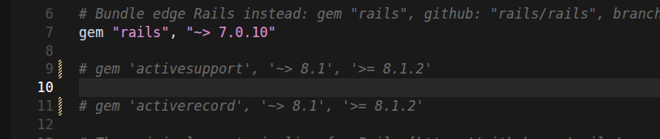
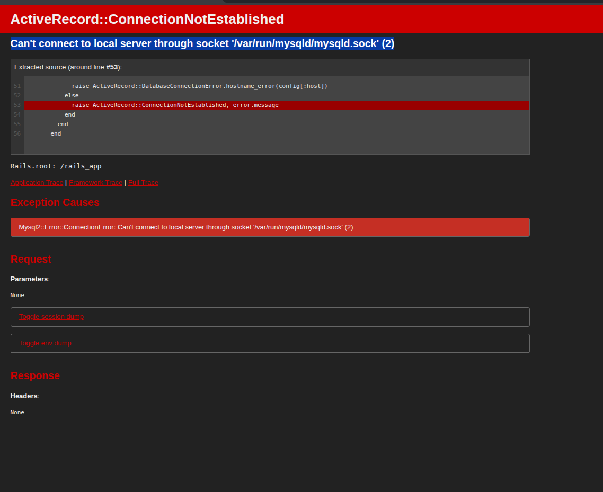
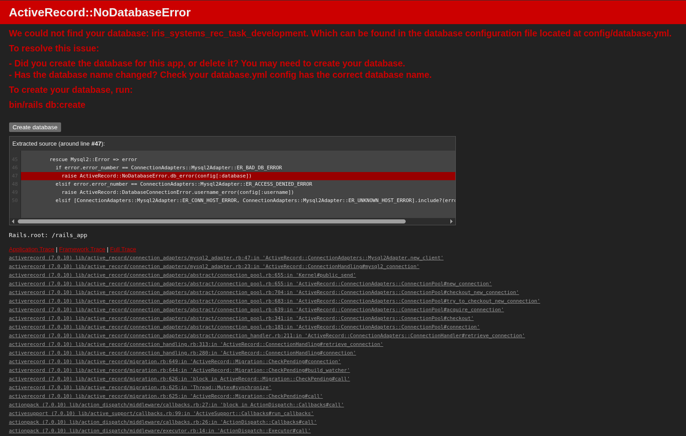
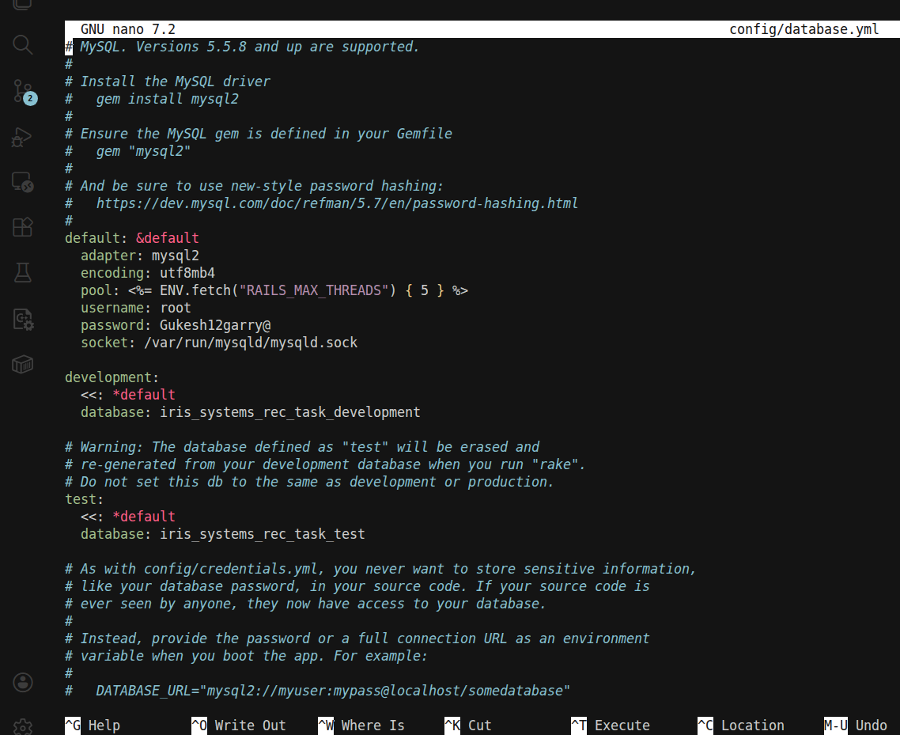
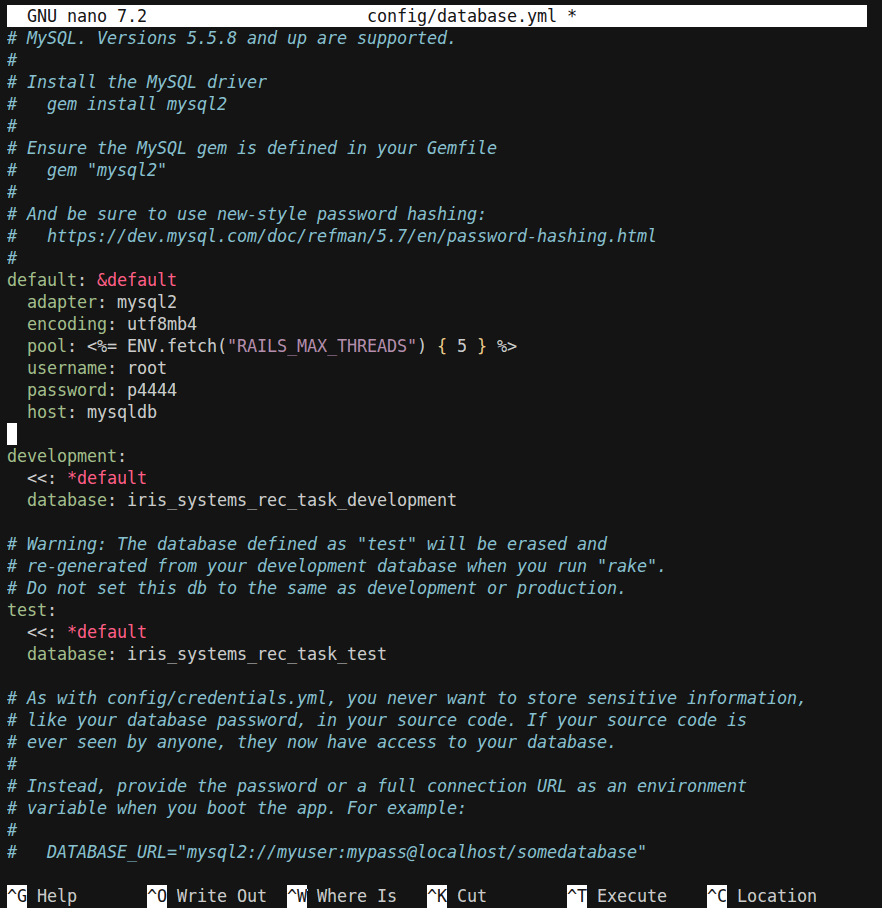
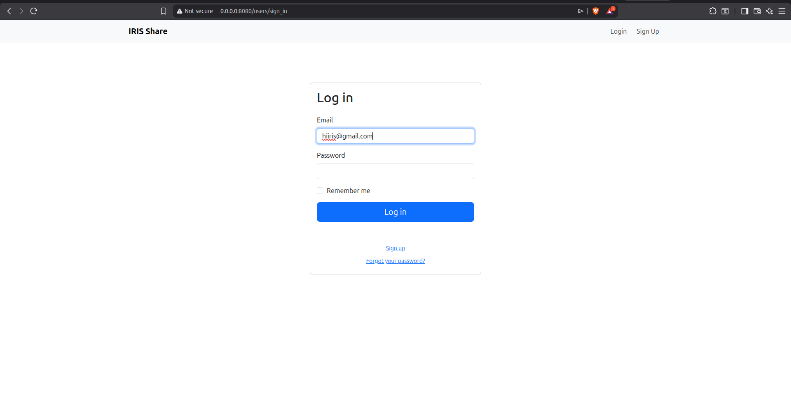
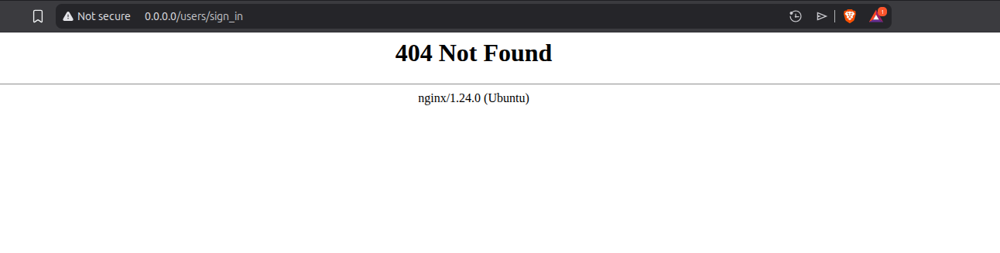
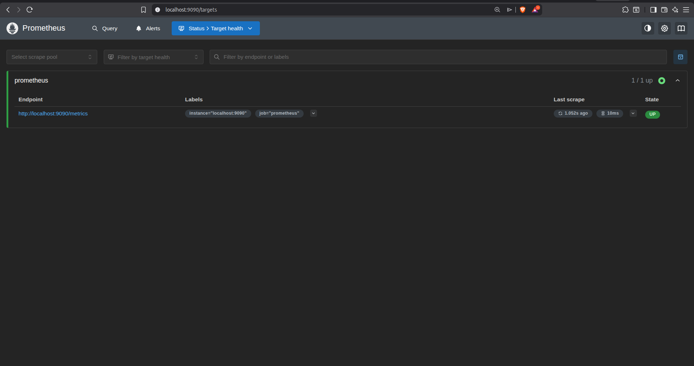
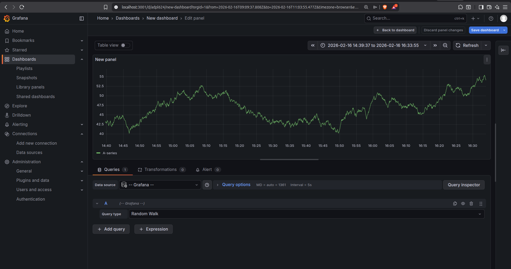

# Iris-sys-recs-2026

## **Task 1: Containerize Rails Application**

**Objective:** Create a Docker image for the Ruby on Rails application to ensure portability and consistent execution environments.

### **1\. Dockerfile**

Created a Dockerfile with the following layers :

* **Base Image:** Used ruby:3.4.1 (from .ruby-version).  
* **Work Directory:** Set to /rails\_app.  
* **Dependency Caching:** Copied Gemfile and Gemfile.lock *before* source code. Ran bundle install to cache gems in a separate layer.  
* **Source Code:** Copied remaining application files (COPY . .).  
* **Networking:** Exposed port 8080\.  
* **Startup:** Defined CMD to run the Rails server bound to 0.0.0.0 to permit external connections.

### **2\. Dependency Conflict Resolution**

**Issue:** bundle install failed due to version mismatch between rails (\~\> 7.0.10) and activesupport (\>= 8.1.2).

**Resolution:**

  
* Modified Gemfile.  
* commented out strict version constraints for activesupport and activerecord.  
* Allowed the main rails gem to resolve correct dependencies automatically.

### **3\. Build and Verify**

* Built image: docker build \-t rails-app-v1 .  
* Ran container: docker run \-p 8080:8080 rails-app-v1  
* Verified access: Accessed http://localhost:8080. Confirmed app loaded (received ActiveRecord::ConnectionNotEstablished error, confirming Rails was running but missing DB).

## **Task 2: MySql Databse Setup**

**Objective:**  setup the application and a MySQL database.

### **Docker Compose Configuration**

Created docker-compose.yml defining two services:

**Service: db (MySQL)**

* Image: mysql:8.0  
* Authentication: Enabled mysql\_native\_password plugin to ensure compatibility with Rails.  

* **Database Connection:** \- Modified config/database.yml to switch from local socket connection to TCP/IP.  
  * Set host: mysqldb in database.yml to match the MySQL service name defined in docker-compose.yaml.  
  * Corrected password mismatch in docker-compose.yaml (removed accidental whitespace in MYSQL\_ROOT\_PASSWORD).

**Automating Setup (Entrypoint Script)**

* **Script Creation:** Created entrypoint.sh to handle pre-startup tasks:  
  1. Removes stale server PIDs (rm \-f /rails\_app/tmp/pids/server.pid).  
  2. Runs database migrations automatically (bin/rails db:migrate).  
  3. Executes the container's main process (exec "$@").  
* **Dockerfile Updates:**  
  * Added COPY instruction for the script.  
  * Added RUN chmod \+x entrypoint.sh to ensure execution permissions.  
  * Set ENTRYPOINT \["./entrypoint.sh"\] to run the script on container start.

* fixed the migration error 

**Service: web (Rails App)**

* Build Context: Current directory (.) from Dockerfile
* Dependency: configured depends\_on: db to ensure DB starts first.  
* mysql server is only exposed to app and cannot be accessed from out side. 

## **Task 4,5,6 : Full Rails-db-nginx Setup**

Created docker-compose.yml defining 3 services:

**Service: db (MySQL)**

* Image: mysql:8.0  
* Authentication: Enabled mysql\_native\_password plugin to ensure compatibility with Rails mysql2 adapter.  
* Persistence: Mounted volume db\_data to /var/lib/mysql.

* **MySQL Persistence:**  
  * Added volume mapping for database persistence: 
  
         - ./db_data:/var/lib/mysql

**Service: web (Rails Apps 1,2,3)**

* Build Context: Current directory (.) from Dockerfile
* Dependency: configured depends\_on: db to ensure DB starts first.  

**Service: nginx(load balancing)**

* **Nginx Config  :** Configured the Nginx container to load-balance incoming requests across the three containers by importing custom config file using  volume mapping : \-  
  
       - ./nginx/nginx.conf:/etc/nginx/nginx.conf     
* **Service Healthchecks:**  
  * Added healthcheck to Rails services (web1, web2, web3) using wget against localhost:8080.  

        healthcheck:
            test: ["CMD", "wget","--spider" ,"-q","http:localhost:8080"]
            timeout: 10s
            retries: 5

  * Updated nginx service to depends\_on web services with condition: service\_healthy to ensure upstreams are up  before Nginx startup.

  * Removed ports mapping from Rails services to isolate them from the host network (internal access only).

## **Nginx Configuration (nginx.conf)**

* **Upstream Port:** Updated upstream rails\_app block to point to port 8080 (matching the Rails container listen port) instead of default 3000\.  

* **Proxy Headers:** Modified location / block to include proxy\_set\_header Host $http\_host;. To ensures the port number is passed to the Rails application, preventing redirects to 0.0.0.0 (port 80\) which caused 404 errors.

## **Monitoring** 

* **Prometheus Setup:**  
  * Created prometheus/prometheus.yml configuration file defining a scrape job for localhost:9090.  
  * Added prometheus service to docker-compose.yaml, mapping the configuration file and exposing port 9090\.  

* **Grafana Setup:**  
  * Added grafana service to docker-compose.yaml on port 3001 (mapped to internal 3000).  
  * Configured Data Source in Grafana UI:  
    * Type: Prometheus  
    * URL: http://prometheus:9090 (using Docker service name for DNS resolution).  
  * Verified connectivity by querying prometheus\_http\_requests\_total.

